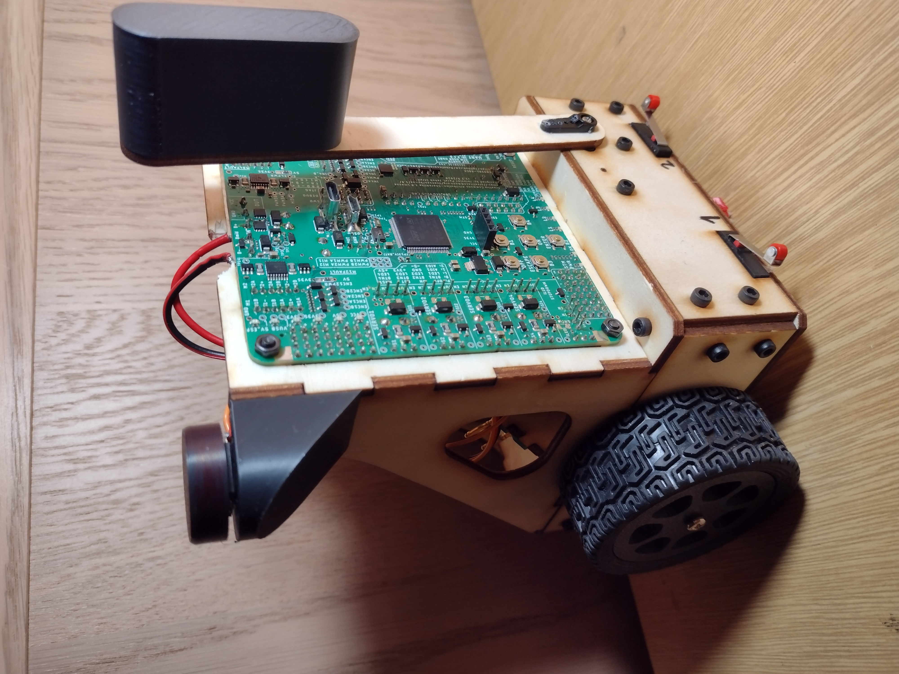
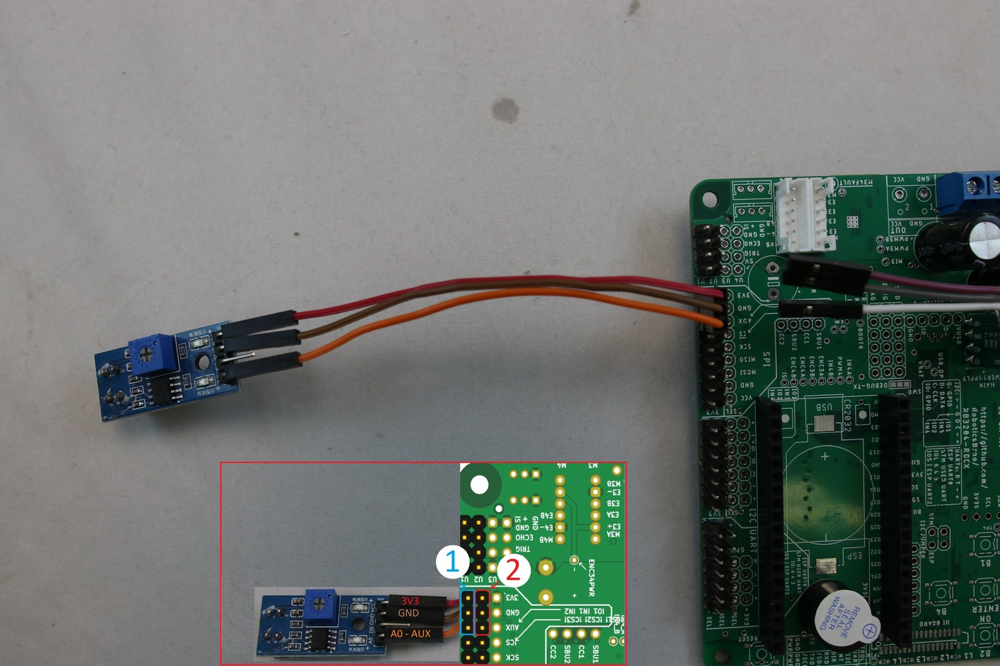

# VÍTĚZNÝ ROBOT na ROBOTIADA 2025 🤖

Firmware pro robota s deskou **RBCX** s **ESP32**, vyvíjený v **PlatformIO**. 




## 📂 Struktura projektu
```
📁 RBCX-Robot - verze_pro_github/
│-- 📂 .pio/           # Složka PlatformIO build output
│-- 📂 .vscode/        # Nastavení VS Code
│-- 📂 include/        # Vlastní knihovny (barvy.h, motorcommands.h)
│-- 📂 src/            # Hlavní kód (main.cpp)
│-- 📂 test/           # Testovací kód
│-- 📜 csache.py       # Urychlení kompilace
│-- 📜 partitions.csv  # Konfigurace paměti pro ESP32
│-- 📜 platformio.ini  # Konfigurace PlatformIO (definice desky, monitor speed...), dulezite je lib_deps, a board_build.partitions = partitions.csv
│-- 📂 lib/            # Stáhnuté knihovny
│-- 📜 README.md       # Dokumentace
```

## 🚀 Instalace a použití
### 1️⃣ Instalace VS Code a PlatformIO
- **Nainstaluj [VS Code](https://code.visualstudio.com/)**.
- **Instaluj rozšíření PlatformIO** a doplňkové balíčky pro C++.

### 2️⃣ Stažení projektu
- Otevři GitHub a klikni na **Code → Download ZIP**.
- Rozbal soubor a otevři ho ve VS Code (**PlatformIO → Open Folder**).

### 3️⃣ Překlad a nahrání
Otevři CLI terminál pomocí "Ctrl + Shift + P" a spusť PlatformIO příkazy. Nezapomeň vybrat správný COM port (např. COM4) nebo alternativně klikni na tlačítka v pravém horním rohu:
```sh
pio run                     # Kompilace
pio run --target upload     # Nahrání
```

## 🔌 Ovládání tlačítek a LED
### Tlačítka na desce
- **Button1, Button2, Button3, Button4** (Up, Left, Right, Down)
- **On, Off, Reset**
- Lze vyvést externě přes piny označene na desce tabulkou `P: ..... B: .... L: .... 1: ..... 2: .....` (Reset button--- P: ___, ____, RST)

### LED indikátory
- **Čtyři LED diody**: `Red`, `Green`, `Blue`, `Yellow`
- Ovládání přes:
```cpp
RK_LED_Blue(true);  // Zapnutí modré LED
RK_LED_Blue(false); // Vypnutí modré LED
```

## 🔧 Připojení periférií
- **4x konektor pro motory s enkodéry**
- **4x sada pinů pro ultrazvukové senzory oznacene jako U1- U4**
- **4x servo konektory**
- **Možnost připojit tlačítka na IN1 a IN2 (analogove hodnoty (ale možné použít jako datové), piny 36, 39) ,IN3 a IN4 (analogove hodnty (ale možné použít jako datové), piny 34, 35), Piny GPIO (na obrazku), piny (dál od středu) -> 27, (blíže) -> 14, nebo další (doporučuji konzultaci)**
- **Napájení**




### Nastavení RBCX knihovny v kódu
V `main.cpp` nastavujeme **rkConfig** ve funkci setup():
Po ozaceni **rkConfig** a zmacknuti klavesy F12 se dostaneme do Nastavení RBCX knihovny.
Zde muze nastavit: 
        , motor_id_left(1)
        , motor_id_right(4)
        , motor_max_power_pct(80)
        , motor_polarity_switch_left(false)
        , motor_polarity_switch_right(true)
        , motor_enable_failsafe(false)
        , motor_wheel_diameter(67)
        , motor_max_ticks_per_second(2000)
        , motor_max_acceleration(10000)
a další.

## 📄 Dokumentace
Všechny funkce, které můžete použít, najdete na [RB3204-RBCX-Robotka Library Documentation](https://roboticsbrno.github.io/RB3204-RBCX-Robotka-library/modules.html)

### Doporučení
Doporučujeme konzultovat s moderními nástroji umělé inteligence, které vám mohou poskytnout detailní vysvětlení účelu jednotlivých souborů v projektu a podpořit tak lepší pochopení struktury a funkcionality.

## 🔗 Další zdroje
- [RB3204 RBCX](https://github.com/RoboticsBrno/RB3204-RBCX/tree/master)
- [RB3204-RBCX-Robotka Library Documentation](https://roboticsbrno.github.io/RB3204-RBCX-Robotka-library/modules.html)
- [RB3204-RBCX-Robotka Library](https://github.com/RoboticsBrno/RB3204-RBCX-Robotka-library)
- [Hodně info:](https://robotka.robotickytabor.cz/coding/000_vyvojove_prostredi.html)

🎯 **Autor:** *(NZ)*

